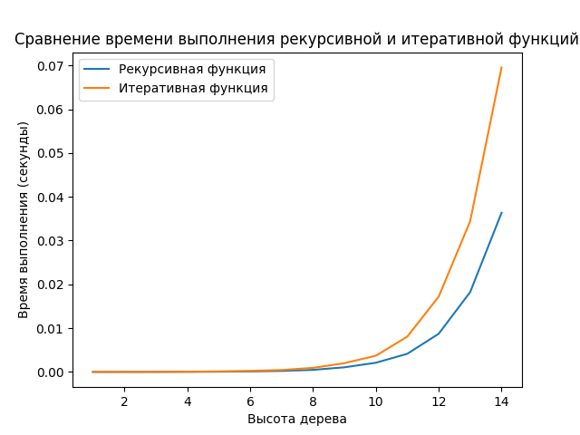

Халилов Чингиз нейротех P3122

Лабораторная работа №6.

написал функцию которая проводит бенчмарк скорости вычисления словаря с деревом двумя разными способами: итеративным и рекурсивным.
она строит график на котором ось  X - количество элементов в дереве, ось Y - время выполнения функции в секундах.

как мы можем увидеть на графике, итеративная функция выполняется дольше чем рекурсивная